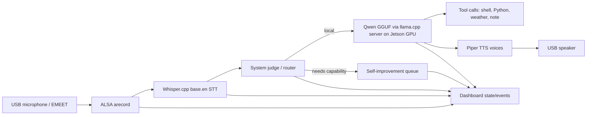

# Architecture

```mermaid
flowchart LR
  A[USB microphone / EMEET] --> B[ALSA arecord]
  B --> C[Whisper.cpp base.en STT]
  C --> D[System judge / router]
  D -->|local| E[Qwen GGUF via llama.cpp server on Jetson GPU]
  D -->|needs capability| F[Self-improvement queue]
  E --> G[Tool calls: shell, Python, weather, note]
  E --> H[Piper TTS voices]
  H --> I[USB speaker]
  B --> J[Dashboard state/events]
  C --> J
  D --> J
  E --> J
  F --> J
```

The daemon is offline-first: the speech loop, local tool use, chat inference, and TTS all run on the Jetson. Optional online hooks are isolated behind environment variables.
