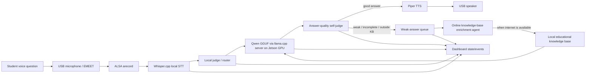

# Architecture

The daemon is offline-first: speech capture, transcription, local Qwen inference, answer-quality judgment, and TTS run on the Jetson. The self-improvement path is deliberately narrow: weakly answered student questions are queued offline, and later connectivity is used to enrich the local educational knowledge base so future offline answers improve.
